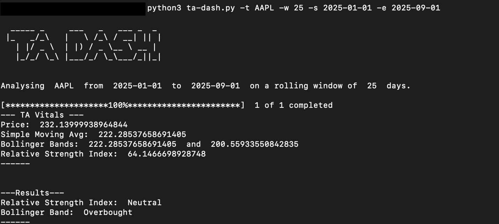

# TA-DASH

A python based tool to generate technical analysis charts for a given ticker using data from yfinance.

## Disclaimer

This project is developed strictly for educational purposes only and is not intended to provide any trading/investment advice. __The developer assumes no responsibility or warranty with respect to the correctness or accuracy of any output generated nor for any damages caused by its use.__. The data generated using this tool should not be relied upon to make any capital market decisions.

## Setup

1) Install the necessary dependancy

``` shell
pip install -r requirements.txt

```

2) Run the python script to perform a sanity check

``` shell
python3 ta-dash.py -h

```
## Usage Instruction and CLI arguments

```
usage: python3 ta-dash.py -t <ticker_name> [-w <window> -s <start_date> -e <end_date>]

```
| Argument | Purpose | Optionality |
|---|---|---|
| ticker | The stock ticker you want to analyse | Required |
| window | The moving window to analyze [in days] (default:20) | Optional |
| start_date | The date from which you want to analyse [in yyyy-mm-dd] (default: '2025-01-01') | Optional |
| end_date | The date from which you want to analyse [in yyyy-mm-dd] (default: today's date) | Optional |

## Example Usage

### Command

``` shell
python3 ta-dash.py -t AAPL -w 25 -s 2025-01-01 -e 2025-09-01

```

### Output



### Sample Charts


The dataframes from which the graphs are generated can be found [here](/docs/sample_output_data/)

## Contributing and Feedback

* Feature suggestions can be shared with the developer using the discussion tab above

* For any bugs or issues encountered during usage, please raise an issue using the issue tab above. 

* Feedback can be shared through the aforementioned discussion tab.

## License and Disclaimer

* This project is licensed under [MIT license](/LICENSE)
